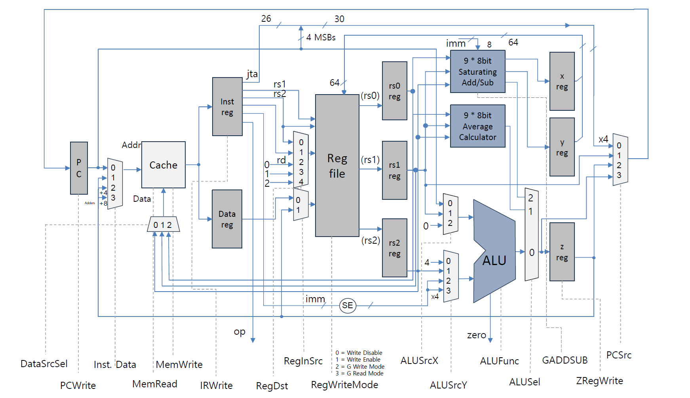

# Specialized Image Processing CPU

## Overview
This project focuses on the design and implementation of a specialized CPU optimized for image processing tasks. The CPU includes custom datapath components and instructions tailored to enhance the performance of graphical computations while maintaining compatibility with general-purpose operations.

## Key Features
- **Custom Instructions for Graphics Processing**
  - `GAVG9B`: Calculates the approximate average of 9 unsigned 8-bit values.
  - `GADD9B` / `GSUB9B`: Performs parallel addition/subtraction of 9 unsigned 8-bit values with saturation logic.
  - `GLOAD` / `GSTORE`: Efficiently loads/stores 96-bit data between memory and registers.

- **Enhanced Datapath Design**
  - Multi-cycle operation for high throughput in memory operations.
  - Dedicated computation blocks:
    - **9×8-bit Saturating ALU** for parallel add/subtract operations.
    - **9×8-bit Average Calculator** for fast averaging tasks.

- **Modified Register File**
  - Supports simultaneous load and read operations for registers $R0, $R1, and $R2.
  - 96-bit register reads and writes with extended control signals.

## Architecture Highlights
1. **Dedicated Modules**
   - Custom-designed logic for specific instructions to maximize efficiency.
2. **Instruction Set**
   - Includes basic arithmetic, logical, and shift operations alongside specialized graphical instructions.
3. **Control State Machines**
   - Implemented state machines for seamless execution of all instruction types.

## Instruction Details
| Instruction | Description                                 | Input                | Output              |
|-------------|---------------------------------------------|----------------------|---------------------|
| GAVG9B      | Average 9×8-bit values (96-bit to 32-bit)  | 96-bit register      | 32-bit register     |
| GADD9B      | Parallel addition with saturation          | 72-bit register + 8-bit value | 72-bit register |
| GSUB9B      | Parallel subtraction with saturation       | 72-bit register + 8-bit value | 72-bit register |
| GLOAD       | Load 96-bit data from memory to registers  | Memory               | 96-bit register     |
| GSTORE      | Store 96-bit data from registers to memory | 96-bit register      | Memory              |

## Implementation Details
- **Hardware Description Language (HDL):**
  - The CPU will be implemented using a hardware description language to ensure modularity and testability.
- **Design Flow:**
  1. Specification and planning.
  2. Datapath design and integration.
  3. Simulation and testing of individual modules.
  4. Final synthesis and optimization.

## License
This project is licensed under the MIT License. See the LICENSE file for more details.
